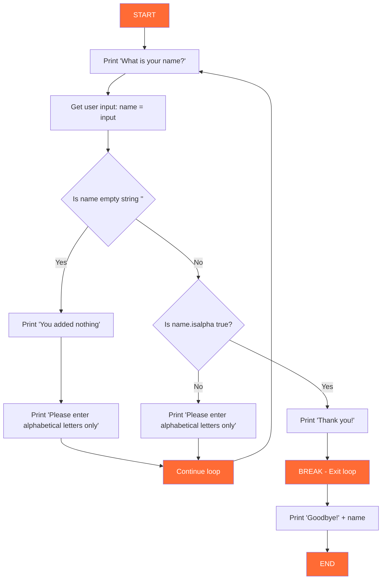

# Chapter 3 Notes

## While Loop Statements

- A while clause will continue to run as long as it is True, if it is false it will result in a skip. 
- You can add if statements inside or after while loops to handle different conditions.
- Remember to use str() when concatenating numbers with strings.

X = 2 
while X < 3:
    print('X is ' + str(X) + ' which is less than 3 for the while statement X < 3.')
    X = X + 2 
    if X > 3:
        print('X = X + 2, X is now greater than 3 with the result being ' + str(X))

In this example X = 2, while 2  < 3 print the string X with the rest of the comment. From there I did X = X + 2 which means 2 + 2 = 4. If 4 > 3 print the second statement. This example was documented under **While Loop Example**. 

## Break Statements

The keyword Break, stops the loop early, causing the loop to exit. 

**Example**

''' python
while True:
    print('What is your name?')
    Name = input('>')

    if Name == '': 
        print('You added nothing.')
        print('Please enter alphabetical letters only')
        # No break here - continues the loop to ask again
    elif Name.isalpha():
        print("Thank you!")
        break  # Exit after valid input
    else: 
        print("Please enter alphabetical letters only")
        # No break here either - continues the loop

print('Goodbye! ' + Name) 

'''

- This code snippet demonstrates a while loop that continues to prompt the user for their name until they provide a valid alphabetical input. It handles empty inputs and non-alphabetical characters by providing appropriate feedback and re-prompting the user.

# While Break Flow Diagram

