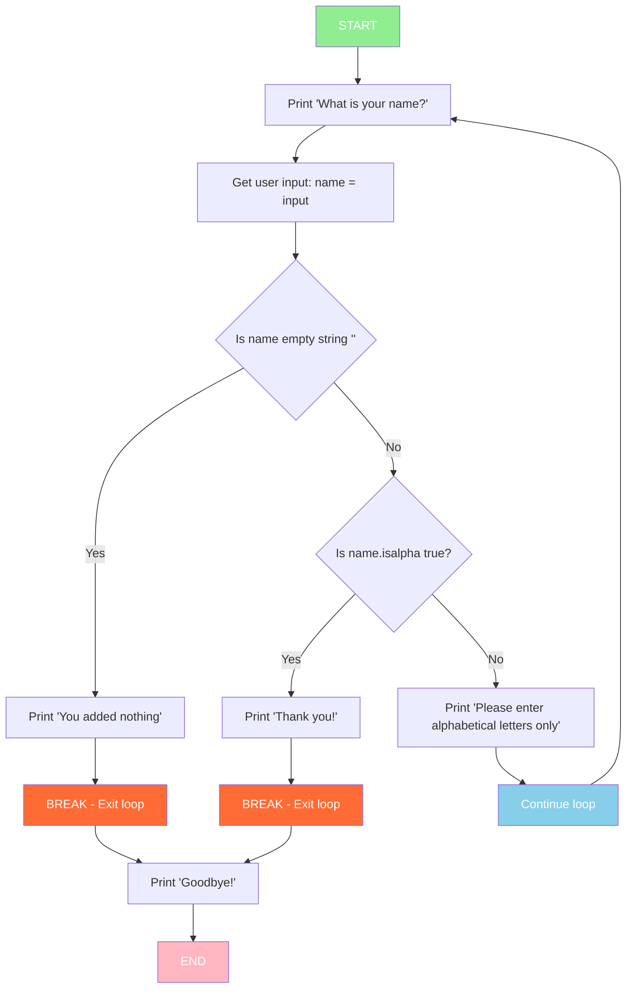

# Chapter 3 Notes

## While Loop Statements

- A while clause will continue to run as long as it is True, if it is false it will result in a skip. 
- You can add if statements inside or after while loops to handle different conditions.
- Remember to use str() when concatenating numbers with strings.

X = 2 
while X < 3:
    print('X is ' + str(X) + ' which is less than 3 for the while statement X < 3.')
    X = X + 2 
    if X > 3:
        print('X = X + 2, X is now greater than 3 with the result being ' + str(X))

In this example X = 2, while 2  < 3 print the string X with the rest of the comment. From there I did X = X + 2 which means 2 + 2 = 4. If 4 > 3 print the second statement. This example was documented under **While Loop Example**. 

## Break Statements

The keyword Break, stops the loop early, causing the loop to exit. 

**Example**

while True:
    print('What is your name?')
    Name = input('>')

    if Name == '': 
        print ('You added nothing.')
        break
    elif Name.isalpha():
            print("Thank you!")
            break
    else: 
            print ("Please enter alphabetical letters only")
            exit()

print ('Goodbye!')

- This code asks the user for their name and checks if the input is valid (only alphabetical letters). If the input is empty, it prompts again. If the input contains non-alphabetical characters, it exits the program.

# While Loop Flow Diagram

